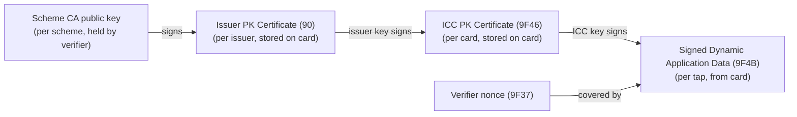

# zkEMV

Zero-knowledge proof (ZKP) of a genuine EMV contactless card signing a verifier challenge

## Introduction

A contactless EMV[^emv] card authenticates itself to a payment terminal with an RSA[^rsa] certificate chain (offline data authentication[^emv-book2]).
zkEMV proves that chain in zero knowledge[^zkp], so a verifier learns that a genuine card signed its nonce (challenge) without learning the card data.
The circuits are written in Noir[^noir] and proved with ProveKit[^provekit].



Codes in parentheses are EMV tags[^emv-tags].
Each arrow is an RSA signature with public exponent 3 and ISO/IEC 9796-2[^iso9796-2] message recovery: cubing the signature modulo the signer's key yields the signed data itself (for a certificate, the next public key) together with a SHA-1[^sha1] hash that the circuit recomputes and compares.
For each signature the circuit checks the header, trailer, format, algorithm indicators, key length, exponent and embedded hash; for each certificate it also rebuilds the next key.
Across the chain, it checks that the issuer identifier matches the PAN[^pan] prefix and that neither certificate has expired.

- **Public inputs:** CA modulus, nonce `9F37`, current month (YYMM), scope; for Visa, also amount `9F02` and currency `5F2A`.
- **Private inputs:** the card's certificates, signature and related data.
- **Output:** a nullifier, the Poseidon2[^poseidon2] hash of the scope and the card's ICC public key: the same for every proof of one card in one scope, unrelated across scopes.
- **Not checked:** CA key and issuer certificate revocation, contents of the signed static data. The `emv` crate checks CA key expiry, outside the circuit.

The scope sets what a verifier can recognise:

| Scope | Nullifier | For |
| --- | --- | --- |
| Unlinkable | none: the prover picks a random scope | card presence, e.g. anti-bot friction |
| Verifier | the same for a card at one verifier | once per card, e.g. a free trial |
| Event | the same for a card at one verifier's event | once per card per event, e.g. a poll |

Both sides derive the scope from the verifier's origin, the prover from the one it authenticated, so a verifier can't ask for another verifier's scope.

| Circuit | Scheme | Key widths in bits (CA / issuer / ICC) | Dynamic signature covers |
| --- | --- | --- | --- |
| `visa_fdda` | Visa fDDA | 1984 / 1408 / 1024 | `9F37 ‖ 9F02 ‖ 5F2A ‖ 9F69`[^9f69] |
| `mastercard_dda` | Mastercard DDA | 1984 / 1920 / 1152 | `9F37` |

## Prerequisites

| Tool | Version | Needed for |
| --- | --- | --- |
| GNU Make[^make] | any | The recipes below |
| Nargo[^nargo] | 1.0.0-beta.26 | Compiling and testing the circuits |
| Rust[^rustup] | 1.98.0, minimum 1.90 | The `emv` crate; rustup installs the version pinned in `emv/rust-toolchain.toml` |
| Python[^python] | 3.14 | Regenerating fixtures and circuit inputs |
| black[^black], mypy[^mypy] | As in `requirements.txt` | Linting and formatting Python sources |
| cargo-criterion[^cargo-criterion] | 1.1.0 | Benchmarking Rust library crate |
| provekit-cli[^provekit-cli] | 1.0.2 | Printing circuit statistics (`make circuit-stats`) |
| Docker[^docker], adb[^adb] | any | Benchmarking on an arm64 Android device |

## Tests

```bash
make test-circuits   # Noir circuit tests
make test-e2e        # compiles the circuits, then proves and verifies each synthetic card tap data
```

Generated files are committed. To regenerate them:

```bash
python3 circuits/scripts/gen_synthetic.py       # rewrites circuits/fixtures/ (deterministic)
python3 circuits/scripts/gen_circuit_inputs.py  # verifies each fixture natively, writes each circuit's Prover.toml and src/tests/vectors.nr
```

## Examples

```bash
make examples
```

Runs one example per scope on `visa_fdda` circuit, with a mock card: a synthetic tap re-signed for each challenge under a test CA.

## Benchmarks

```bash
make circuit-stats
make bench
make bench-android
```

`circuit-stats` prints each circuit's R1CS constraint and witness counts under ProveKit.
The benchmarks prove and verify each circuit's synthetic card tap data.
When benchmarking on an arm64 Android device, already connected over adb, it cross-compiles the benchmark binary with the Android NDK[^ndk] inside Docker (`Dockerfile.bench-android`).
Keep the device's screen on for the whole run, with the screen off, Android throttles the CPU and the captured timings vary several-fold.

| Environment | Circuit | Prove | Verify | Proof size |
| --- | --- | --- | --- | --- |
| Ubuntu 26.04 on Intel Core i7-1260P with 16 threads and 15GB RAM | `visa_fdda` | 608 ms | 76 ms | 612.8 KiB |
| Ubuntu 26.04 on Intel Core i7-1260P with 16 threads and 15GB RAM | `mastercard_dda` | 805 ms | 85 ms | 638 KiB |
| Android 16 on Samsung Galaxy S25 Ultra (Snapdragon 8 Elite) with 8 cores and 12GB RAM | `visa_fdda` | 721 ms | 80 ms | 616.8 KiB |
| Android 16 on Samsung Galaxy S25 Ultra (Snapdragon 8 Elite) with 8 cores and 12GB RAM | `mastercard_dda` | 870 ms | 95 ms | 636.3 KiB |

> [!INFO]
> None of the devices were connected to direct power during the benchmark experiments.

## License

Licensed under either of Apache License 2.0 (`LICENSE-APACHE`) or MIT license (`LICENSE-MIT`), at your option.
Unless you explicitly state otherwise, any contribution intentionally submitted for inclusion in this work, as defined in the Apache-2.0 license, shall be dual licensed as above, without any additional terms or conditions.

## References

[^emv]: EMV. Wikipedia. <https://en.wikipedia.org/wiki/EMV>
[^rsa]: RSA cryptosystem. Wikipedia. <https://en.wikipedia.org/wiki/RSA_cryptosystem>
[^emv-book2]: EMV Book 2: Security and Key Management. EMVCo. <https://www.emvco.com/specifications/book-2-security-and-key-management/>
[^zkp]: Zero-knowledge proof. Wikipedia. <https://en.wikipedia.org/wiki/Zero-knowledge_proof>
[^noir]: Noir. <https://noir-lang.org>
[^provekit]: ProveKit. <https://docs.provekit.org/>
[^emv-tags]: Complete list of EMV & NFC tags. EFTlab. <https://www.eftlab.com/knowledge-base/complete-list-of-emv-nfc-tags>
[^iso9796-2]: ISO/IEC 9796-2:2010, Digital signature schemes giving message recovery, Part 2: Integer factorization based mechanisms. <https://www.iso.org/standard/54788.html>
[^sha1]: SHA-1. Wikipedia. <https://en.wikipedia.org/wiki/SHA-1>
[^pan]: Payment card number. Wikipedia. <https://en.wikipedia.org/wiki/Payment_card_number>
[^poseidon2]: Grassi, Khovratovich, Schofnegger. Poseidon2: A Faster Version of the Poseidon Hash Function. <https://eprint.iacr.org/2023/323>
[^9f69]: `9F69`, Card Authentication Related Data: fDDA version number, card unpredictable number and card transaction qualifiers. EMV Book C-3: Kernel 3 Specification. EMVCo. <https://www.emvco.com/specifications/book-c-3-kernel-3-specification/>
[^make]: GNU Make. <https://www.gnu.org/software/make/>
[^nargo]: Nargo, the Noir toolchain. <https://noir-lang.org/docs>
[^rustup]: rustup, the Rust toolchain installer. <https://rustup.rs>
[^python]: Python. <https://www.python.org>
[^black]: Black, the Python code formatter. <https://github.com/psf/black>
[^mypy]: mypy, a static type checker for Python. <https://mypy-lang.org>
[^cargo-criterion]: cargo-criterion. <https://github.com/bheisler/cargo-criterion>
[^provekit-cli]: provekit-cli, ProveKit's command-line tool. <https://crates.io/crates/provekit-cli>
[^docker]: Docker. <https://www.docker.com>
[^ndk]: Android NDK. <https://developer.android.com/ndk>
[^adb]: Android Debug Bridge. <https://developer.android.com/tools/adb>
